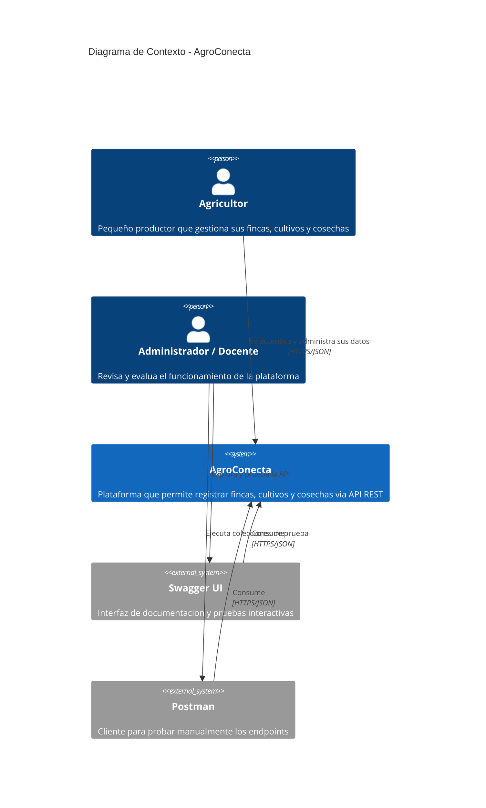
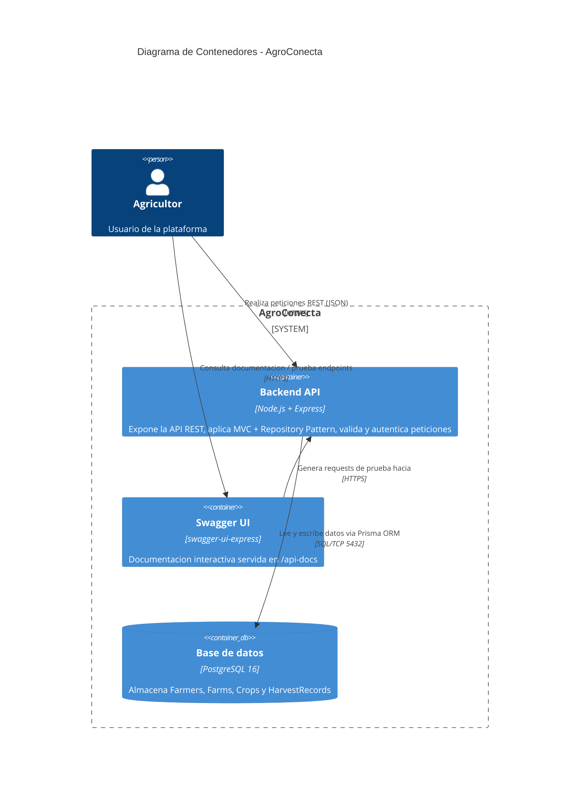
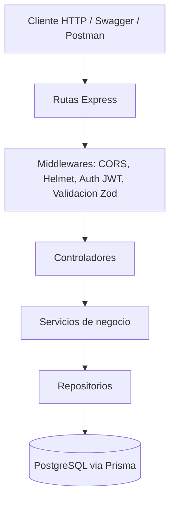

# Diagramas C4 — AgroConecta

## Nivel 1 — Diagrama de Contexto

Muestra el sistema AgroConecta y cómo interactúan con él los usuarios y
sistemas externos.

## Nivel 2 — Diagrama de Contenedores

Muestra los contenedores (aplicaciones/servicios desplegables) que componen
AgroConecta y cómo se comunican entre sí.

## Nivel 2 (detalle interno) — Capas del monolito

Vista adicional que muestra las capas internas del contenedor "Backend API",
útil para explicar el patrón MVC + Repository durante la defensa.

