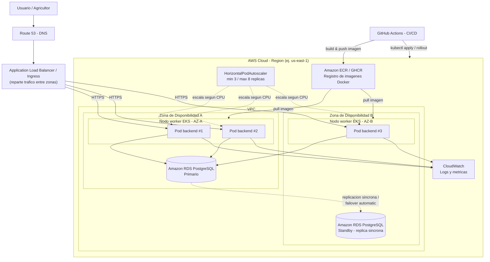

# Despliegue Cloud, Kubernetes y Escalabilidad — AgroConecta

## 1. Diagrama de arquitectura Cloud (propuesta AWS)

El diagrama muestra explícitamente **alta disponibilidad Multi-AZ**: los
Pods del backend se distribuyen en dos zonas de disponibilidad distintas
(tolerando la caída completa de una zona), un **Application Load Balancer**
distribuye el tráfico entre ellos, y la base de datos usa **RDS Multi-AZ**
con una instancia primaria y una réplica standby sincrónica que asume el
rol de primaria automáticamente ante una falla (failover automático).

**Elementos de alta disponibilidad y escalabilidad horizontal que muestra
el diagrama:**

- **Multi-AZ a nivel de cómputo**: los 3 Pods del Deployment se reparten en
  dos zonas de disponibilidad distintas (vía `topologySpreadConstraints` /
  afinidad de nodos en un clúster EKS real), de modo que la caída de una AZ
  completa no deja el servicio sin réplicas.
- **Multi-AZ a nivel de base de datos**: RDS en modo Multi-AZ mantiene una
  réplica sincrónica en otra zona; si la instancia primaria falla, RDS
  promueve automáticamente la standby sin intervención manual.
- **Balanceador de carga (ALB/Ingress)**: reparte el tráfico entrante entre
  todas las réplicas sanas, sin importar en qué zona estén.
- **Escalabilidad horizontal**: el `HorizontalPodAutoscaler` añade o quita
  Pods automáticamente (entre 3 y 8) según el uso de CPU, y el ALB
  incorpora las nuevas réplicas al balanceo sin configuración manual.

## 2. Explicación de AWS

Para producción se propone desplegar en **Amazon EKS (Elastic Kubernetes
Service)**, el servicio administrado de Kubernetes de AWS:

- **EKS** administra el control plane de Kubernetes (alta disponibilidad,
  parches de seguridad), dejando al equipo enfocarse solo en los workloads
  (Deployments, Services).
- **Amazon RDS para PostgreSQL** reemplazaría al contenedor de Postgres en
  producción: ofrece backups automáticos, alta disponibilidad Multi-AZ y
  escalado vertical sin gestionar el motor de base de datos manualmente.
- **ECR (Elastic Container Registry)** o **GHCR (GitHub Container Registry)**
  almacena las imágenes Docker versionadas que construye el pipeline de CI.
- **CloudWatch** centraliza logs y métricas de los pods para monitoreo y
  alertas.
- Un **Load Balancer** (Network o Application Load Balancer, provisto
  automáticamente por el `Service` de tipo `LoadBalancer` en EKS) distribuye
  el tráfico entrante entre las réplicas del backend.

Este diseño es solo una **propuesta**: en el entorno académico el proyecto
se ejecuta localmente con Docker Compose o en un clúster de Kubernetes local
(Minikube/Kind/Docker Desktop), pero la arquitectura de los manifiestos
(`k8s/`) es la misma que se usaría en la nube — solo cambia dónde corre el
clúster.

## 3. Explicación de Kubernetes

Kubernetes es el orquestador de contenedores elegido para producción porque
resuelve automáticamente:

- **Deployment**: declara el estado deseado del backend (imagen a usar,
  número de réplicas, variables de entorno, límites de recursos). Kubernetes
  se encarga de mantener ese estado: si un Pod falla, lo reemplaza
  automáticamente (self-healing).
- **Service**: expone un conjunto de Pods bajo una IP/DNS estable y realiza
  **balanceo de carga** entre ellos. En este proyecto se usa un `Service`
  de tipo `LoadBalancer` para exponer el backend al exterior.
- **ConfigMap / Secret**: separan la configuración (variables de entorno) y
  los datos sensibles (contraseñas, JWT secret) del código de la aplicación,
  siguiendo la metodología *12-Factor App*.
- **Readiness / Liveness Probes**: Kubernetes consulta `/health` para saber
  si un Pod está listo para recibir tráfico (`readinessProbe`) o si necesita
  ser reiniciado por estar colgado (`livenessProbe`).
- **RollingUpdate**: al desplegar una nueva versión, Kubernetes reemplaza los
  Pods de forma gradual (`maxSurge: 1`, `maxUnavailable: 0`), evitando
  downtime.

## 4. ¿Qué hace un `Deployment`?

Un `Deployment` es un objeto de Kubernetes que garantiza que siempre exista
un número determinado de réplicas (Pods) de la aplicación corriendo. Si se
cae un Pod, el Deployment crea uno nuevo automáticamente. También gestiona
las actualizaciones controladas (rolling updates) y permite hacer rollback
a una versión anterior si algo falla.

## 5. ¿Qué hace un `Service`?

Un `Service` expone un grupo de Pods bajo una única dirección de red
estable, aunque los Pods individuales cambien de IP al reiniciarse. Además,
distribuye ("balancea") las peticiones entrantes entre todas las réplicas
disponibles, funcionando como un balanceador de carga interno (o externo,
si es de tipo `LoadBalancer`).

## 6. Escalabilidad y ¿por qué 3 réplicas?

El `Deployment` del backend (`k8s/deployment.yaml`) se configura con
**`replicas: 3`** por las siguientes razones:

1. **Alta disponibilidad**: con 3 réplicas, si un Pod falla o está siendo
   actualizado, siempre quedan al menos 2 Pods sirviendo tráfico — el
   servicio nunca queda completamente caído.
2. **Distribución de carga**: el `Service` reparte las peticiones entre las
   3 réplicas, mejorando el throughput frente a tener una sola instancia.
3. **Demostración académica de escalabilidad horizontal**: 3 es un número
   suficiente para evidenciar el concepto de réplicas sin sobredimensionar
   innecesariamente los recursos de un entorno de pruebas (Minikube/Kind).
4. **Compatibilidad con actualizaciones sin downtime**: la estrategia
   `RollingUpdate` con `maxUnavailable: 0` necesita más de una réplica para
   funcionar correctamente durante un despliegue.

Adicionalmente se incluye un **`HorizontalPodAutoscaler`**
(`k8s/hpa.yaml`) que escala automáticamente entre 3 y 8 réplicas según el
uso de CPU (objetivo: 70% de utilización promedio), demostrando
**escalabilidad horizontal automática** basada en demanda real, un paso más
allá de un número fijo de réplicas.

## 7. Docker vs Kubernetes — Resumen

| Herramienta       | Rol                                                                 |
|--------------------|----------------------------------------------------------------------|
| Docker             | Empaqueta la aplicación y sus dependencias en una imagen portable    |
| Docker Compose     | Orquesta múltiples contenedores (backend + postgres) en **una sola máquina**, ideal para desarrollo local |
| Kubernetes         | Orquesta contenedores en **un clúster de múltiples nodos**, con auto-sanación, balanceo de carga, escalado automático y despliegues sin downtime — pensado para producción |
